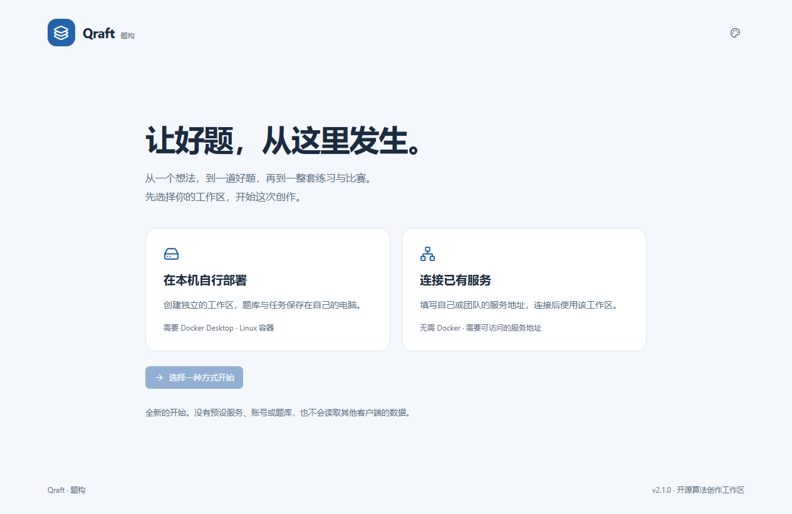

<div align="center">
  
  <h1>Qraft · 题构</h1>
  <p><strong>从一道好题，到一套好题。</strong></p>
  <p>AI 辅助出题 · 混合题集 · 题库组卷 · 可复现验证</p>
  <p>
    <a href="https://github.com/Gingoo-TvT/Qraft/releases/latest"></a>
    <a href="https://github.com/Gingoo-TvT/Qraft/actions/workflows/ci.yml"></a>
    <a href="LICENSE"></a>
    
  </p>
  <p>
    <a href="https://github.com/Gingoo-TvT/Qraft/releases/latest">下载客户端</a> ·
    <a href="docs/windows-desktop.md">开始使用</a> ·
    <a href="docs/self-hosting.md">自行部署</a> ·
    <a href="docs/development.md">参与开发</a>
  </p>
</div>

---

Qraft 是一个开源的算法题创作工作区。用自然语言描述需求，生成编程题、混合题型题集或纯编程比赛；也可以从已有题库筛选、组卷、校验并导出。

Windows 原生窗口与 Web 共用业务界面。客户端负责交互，服务端负责模型编排、代码验证、数据生成和题库存储。你可以在自己的电脑上运行完整服务，也可以连接管理员提供的已有服务。



## V2.3.0 · 团队共享、来源难度与人工审核

- **团队账号**：管理员邀请注册，Web 与桌面统一登录，共享题库、隔离各自任务。
- **题目评估**：优先参考原站难度，结合已有来源题目与人工正式评分校正；人工评价和管理员确认值独立保留。
- **人工审核**：管理员可确认当前题目并覆盖自动质量拦截，保留原始证据及本次决定；修复网页编辑、分页、导出和图片显示。

[查看完整发行说明](docs/releases/v2.3.0.md) · [下载 V2.3.0](https://github.com/Gingoo-TvT/Qraft/releases/tag/v2.3.0)

V2.3.0 提供配套客户端与后端包。客户端内置更新不会自动升级后端；升级服务前备份并等待任务结束，保留原数据库及资料目录。真实 Rating 效果与人类试点仍需单独验证，详见[题目评估指南](docs/problem-rating.md)。

## 选择适合你的使用方式

| | 连接已有服务 | 在本机自行部署 |
|---|---|---|
| 适合 | 已有可用工作区的使用者 | 希望独立保存题库的个人或小团队 |
| 安装内容 | Qraft 客户端、WebView2 | 左侧内容 + Docker Desktop + 后端镜像包 |
| 首次操作 | 填写服务根地址，保存并检测 | 导入后端包，启动服务，配置模型 |
| 数据保存 | 所连接服务的数据库与对象存储 | 自己电脑上的独立 Docker 数据卷 |
| 用户侧需要 WSL / Docker | 不需要 | Docker 使用 Linux 容器；WSL 2 可作为其后端 |

首次打开会显示使用方式选择页，**没有预设服务地址**。新安装不读取其他产品的配置、历史记录或题库；模型与去重服务由你配置。新建后端的业务数据为空，程序自带的知识点、标签和默认规则用于正常工作。

## 可以做什么

- **描述需求，开始出题** — 单道编程题、完整编程比赛，或编程、选择、填空、判断混合题集。题数、难度与分值可以明确指定。
- **让模型分工协作** — 生成、解答、测试数据和复核分别编排；任务状态持久化，失败可定位与重试，关闭客户端后后端任务继续运行。
- **一起检索两类题库** — 按题号、标题、标签和知识点匹配部分文字，再用题型、标签与原有难度筛选；网页和客户端共用搜索页。
- **把题库组织成题集** — 在题库跨页勾选，直接新建题集或加入已有题集；也可按知识点、难度和关键词自动选题。手动编排支持草稿与待审题，保存时跳过重复项，无需调用模型。
- **在沙箱里验证** — 编译解法、执行测试、检查输入输出与资源限制；固定 C++ 数据生成框架支持保存种子后的重复生成与对拍。
- **管理自己的工作区** — 编程题与客观题题库、模型 API 与推理强度、语义去重、任务和质量记录集中管理。
- **按喜欢的方式工作** — 六套配色、浅色/深色/跟随系统、自定义主题、键盘搜索和原生文件保存。
- **在客户端内更新** — 手动检查正式版本，下载并校验后安装重启，保留原连接与资料目录；不影响运行中的后端。

支持从 **外部链接或粘贴题面** 开始：保留原题意并整理成严格的 OJ 格式、保留并校验样例，或作为新题创意；重新生成数据、逐题去重并评估难度，重复与失败不会阻塞其余题目，导入清单支持逐项删除和粘贴替换。题集提供 **通用 ZIP** 与 **Hydro ZIP** 两个测试下载入口，保留题序、分值和数据；混合题型使用通用包，纯编程题可整包导入 Hydro。查看[链接导入与测试导出](docs/source-import-export.md)、[题集与组卷](docs/problem-set-assembly.md)。

## 三步开始

1. **下载** [最新 Release](https://github.com/Gingoo-TvT/Qraft/releases/latest) 中的 Windows 安装包或便携 ZIP。便携版解压后运行 `Qraft.exe`。
2. **选择使用方式**：连接已有服务时填写根地址；自行部署时按界面导入 Release 配套的后端包并启动（V2.3.0 使用配套 V2.3.0 后端包）。
3. **配置并创作**：独立部署者先设置模型和去重服务，之后在工作台写下出题需求。

连接已有服务时不需要下载后端镜像包。模型通过你配置的 API 调用，不要求本地 GPU。完整步骤、WebView2 安装、数据位置与升级方式见 [Windows 使用指南](docs/windows-desktop.md)。

<details>
<summary><strong>下载文件分别是什么？</strong></summary>

| 文件 | 用途 |
|---|---|
| `Qraft-*-windows-x64-setup.exe` | 安装版，带卸载程序 |
| `Qraft-*-windows-x64-portable.zip` | 免安装客户端、许可和使用说明 |
| `Qraft-*-windows-x64.exe` | 独立 EXE，需已安装 WebView2 |
| `Qraft-*-backend-linux-x64.tar.gz` | 自行部署所需的完整后端镜像包 |
| `SHA256SUMS.txt` / `runtime-manifest.json` | 下载文件及后端镜像的身份校验 |

</details>

## 自行部署与开发

Windows 用户可以直接使用客户端的本机部署流程。Linux / WSL 开发者可以从源码运行：

```bash
git clone https://github.com/Gingoo-TvT/Qraft.git
cd Qraft
make backend-up
```

这会生成仅属于本机的凭据、构建服务并启动配置工作区。打开 `http://localhost:18180`，按[账号指南](docs/shared-service-auth.md)初始化管理员，保存模型与去重配置后运行 `make worker-up`。详细前置条件、端口、数据与停止方式见[自部署指南](docs/self-hosting.md)。

| 目录 | 内容 |
|---|---|
| `frontend/` | 共享 Web 页面、桌面界面和主题 |
| `desktop/` | Windows 原生窗口、服务连接、本机部署与打包 |
| `backend/` | API、模型编排、题库、组卷与数据生成工具 |
| `sandbox/` | 独立代码执行与资源限制 |
| `docs/` | 使用、开发、API 与格式文档 |
| `scripts/` | 小型配置与仓库检查工具 |

构建输出、客户端资料和实例数据不进入 Git。项目采用一个主仓库持续开发；贡献方式见 [CONTRIBUTING](CONTRIBUTING.md)。

## 文档导航

[V2.3.0 发行说明](docs/releases/v2.3.0.md) · [使用客户端](docs/windows-desktop.md) · [自部署](docs/self-hosting.md) · [公网部署](docs/cloud-deployment.md) · [主题扩展](docs/desktop-themes.md) · [题集生成](docs/problem-set-generation.md) · [组卷](docs/problem-set-assembly.md) · [数据生成框架](docs/testdata-framework.md) · [题目评估](docs/problem-rating.md) · [账号与权限](docs/shared-service-auth.md) · [API 参考](docs/api-reference.md) · [架构](docs/architecture.md) · [开发](docs/development.md)

## 当前边界

当前源码支持管理员邀请的团队共享工作区：成员共享已发布题库，任务按账号隔离，模型配置由管理员管理；默认源码部署仅监听本机回环地址。公网使用需要 HTTPS 入口和账号模式，参见[公网部署](docs/cloud-deployment.md)。独立租户、组织层级、邮箱发送与多实例高可用不在本期范围，发行包能力以对应版本说明为准。

模型生成与自动验证可以辅助创作，但不保证每道题目的正确性或比赛适用性。正式使用前应人工审阅题面、解法、数据和难度。独立实例之间不会自动合并题库或进行全局去重。

## 开源许可

Qraft 的项目代码采用 [MIT License](LICENSE)。第三方组件保留各自许可，见 [THIRD_PARTY_NOTICES](THIRD_PARTY_NOTICES.md)。欢迎提交问题、改进文档与贡献代码。


#### 题集 ZIP 与 OJ 模板

题集详情提供 **通用 ZIP** 和 **Hydro ZIP**。通用包包含与导入模板一致的 19 列混合题型 Excel、12 列测试点配置及 `datas/题目编号/` 数据；支持上传目标 OJ 的标签 JSON，按有效 ID/完整路径/唯一名称匹配，保留无法匹配的说明。编程题按六档 rating 规则导出，原始分数继续保留。Hydro 包用于纯编程题库。两种下载均保留数据验证检查，不自动发布题目。详情见 [题集测试包说明](docs/source-import-export.md)。


原题导入支持保留已完成结果并继续未完成项目。导入难度优先保留原站难度，并参考有效来源和人工正式评分进行校正；参考难度失败不影响题目和新数据保存。完整规则见 [来源导入与测试导出](docs/source-import-export.md)。
