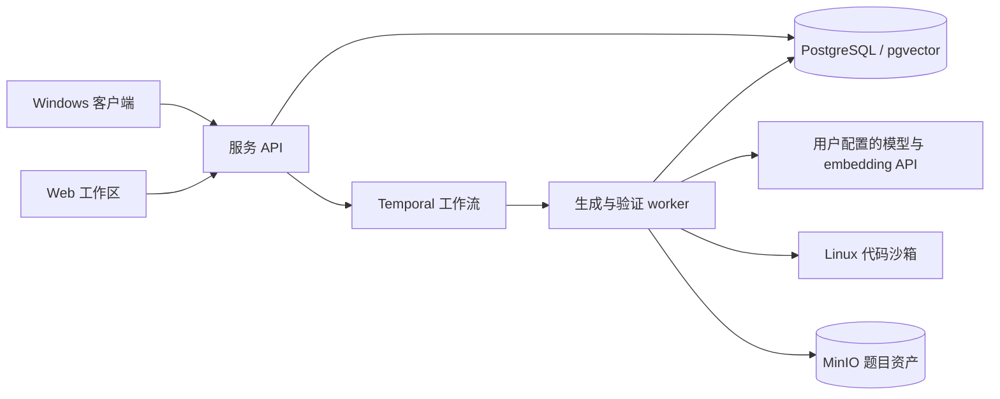

# 架构

Qraft 由共享界面、原生客户端和独立服务组成。两种使用方式复用同一个后端，不复制题库逻辑。

## 职责边界

- `frontend/`：业务页面、主题、输入状态、任务与数据展示。桌面使用 Vite 打包这些页面，Web 使用 Next.js。
- `desktop/`：WebView2 窗口、用户选择的服务连接、回环代理、原生文件操作和可选的 Docker 管理。
- `backend/`：题目、题集、组卷、持久化模型配置、工作流与导出。模型密钥在服务端加密保存。
- `sandbox/`：编译与执行，使用 nsjail、固定工具链和资源限制。模型生成的代码不在客户端执行。

桌面首次启动没有目标地址，不挂载会读取题库的业务页面。保存已有服务后才建立连接；本机模式还须确认所属网关与端口，不能把碰巧占用端口的其他服务识别为自己的工作区。

## 数据与初始化

客户端配置、安装身份和 Docker 项目均使用 Qraft 独立目录。发行包包含程序、镜像和说明，不包含运行数据库、实例密钥、浏览器资料或用户题库。基础迁移会建立结构与通用字典；题目、题集、任务和模型设置由用户操作创建。

题目资产与关系数据分开保存；生成任务使用 Temporal 持久化，因此关闭客户端不代表取消生成。组卷从现有题库确定性筛选，不调用模型。

## 模型编排与验证

题面、解法、数据计划、独立验证和修复反馈按工作流组织；无依赖阶段可并行。模型配置与推理强度由工作区设置决定。固定数据生成库提供常见数组、树、图等构造，专用方案在沙箱执行并保留种子和身份。

验证检查能给出具体失败与可复现材料，但有限测试不能证明所有输入上的正确性。结果质量仍需要出题者审阅。内部兼容协议的标识保留稳定，不为更换产品名称而强制重写已有 API 消费者。

## 导出

编程题使用 Hydro 原生格式。Qraft 题集包使用可读 JSON 主清单保存顺序、分值和题型，搭配编程题子包与客观题工作簿。空白导入模板由代码生成，不依赖外部系统的 Excel 文件。
