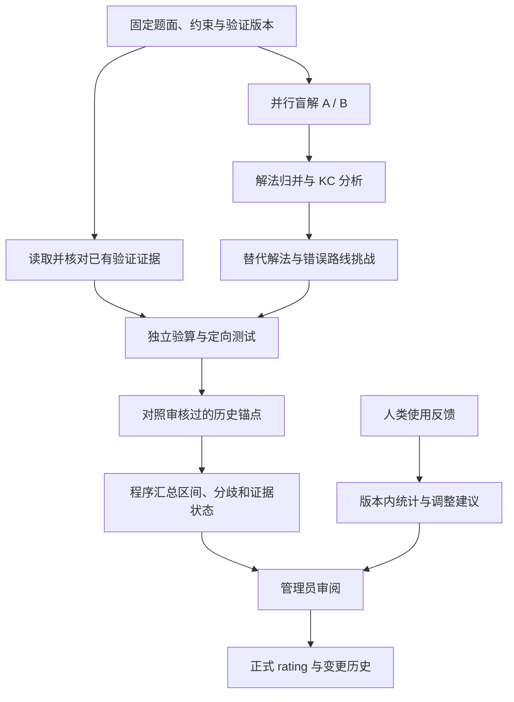

# Qraft 题目 Rating 与知识组件评估：已确认方案与实现边界

状态：项目负责人于 2026-09-16 确认方案，进入实施。

实际交付与启用限制见[使用指南](../problem-rating.md)。本期使用冻结测试验证；新增反例自动合法性证明、共同锚点人类作答后的统计拟合属于后续实测工作，不能从架构图推断已实现。

本稿依据 [issue #8](https://github.com/Gingoo-TvT/Qraft/issues/8)、其设计附件、当前 WSL 源码及研究文献整理。附件是参考，不是已接受的规格。负责人已确认首期单道编程题及 30 名有效评价者触发复核；正式改分由管理员确认。

## 1. 已确定的方向与首期边界

项目负责人已确认：

- 以 Codeforces 风格分数为参照，同时保留 Qraft 自身的人类使用数据与实测难度。
- 首期在 Qraft 内人工评价，记录独立完成情况、耗时、卡点、实际解法；OJ 数据接入后续再做。
- 达到条件后生成 rating 调整建议和证据，由管理员确认；以后再讨论受限自动调整。
- 最终设计由项目负责人批准。
- 当前没有指定 KC 论文/目录，也没有已提供的锚点或人类作答资料；需要先提出材料清单并请负责人确认。

已确认首期针对**单道编程题**完成整条流程。混合题集可以引用其中编程题的结果；客观题的猜测因素、整场比赛的时间分配与题间影响另行设计，不能将编程题 rating 直接相加。

建议产品名为“题目评估”。它回答三个相互关联但不同的问题：题目是否有效、通过哪些路径能解出、目标人群实际觉得多难。

## 2. 当前源码意味着什么

当前题目的 difficulty 主要保存出题请求的目标难度；审题模型给出的 estimated_difficulty 并不等于已经完成了独立校准。现有知识点组合检查也不能证明指定知识组件在所有解法中都不可绕过。

因此应分开保存和显示：

| 数据 | 意义 | 谁能改变 |
|---|---|---|
| 目标难度 | 出题时希望达到的强度，保留现有字段兼容性 | 出题人修改需求 |
| 初始估计 | 基于解法、KC、验证与锚点得到的 CF 风格参考区间 | 一次新的评估运行 |
| 人类实测 | 特定人群、作答条件和题目版本下的观察与统计估计 | 新评价及重新计算 |
| 正式 rating | 管理员接受的当前发布值，带来源与版本 | 有权限的明确确认操作 |

没有正式值时显示“暂定”，不能把目标难度冒充实测结果。尚不满足统计建模条件时，人类实测可以只有分组结果和不确定性，不强行生成第二个精确分数。

不直接覆盖原 difficulty：当前修改它会影响题目发布状态及验证证据有效性；单纯调整 rating 不应迫使用户重新验题。

## 3. KC 模型：按解法记录，按证据判断

### 3.1 KC 的粒度

算法标签用于检索，KC 用于解释完成某个推理步骤需要什么。初期复用现有知识点目录并添加少量人工审核的 KC 定义，不另建全套学科体系。

例如“二分”可以进一步描述为“把最优化问题转成判定问题”“证明判定具有单调性”“实现边界正确的搜索”。不是每题都必须拆到语法节点；只拆到能解释绕过、错误或难度差异的程度。

每个 KC 记录稳定编号、定义、适用条件、正例、容易混淆的概念和相关原有知识点 ID。模型新增或调整的定义先作为候选，不自动改写目录。

### 3.2 一道题允许多条有效路径

结构示意，非实际题目评估结果：

```text
题目
 ├─ 路径 A：构造判定 → 单调性证明 → 二分 → 实现
 └─ 路径 B：结构观察 → 排序 → 交换论证 → 贪心实现

A 或 B 都可能解题；每条路径内部需要相应步骤的组合。
```

分别标记“出题人预期 KC”“路径实际依赖 KC”“已发现可绕过的 KC”“候选误导路径”。在当前已知路径中都出现的 KC，只能叫“已知解法共有”，不能据此断言它绝对必要。

### 3.3 对绕过与误导的处理

| 发现 | 要收集的证据 | 对 rating 的处理 |
|---|---|---|
| 有效替代解法 | 算法、正确性论证、复杂度、实现、测试，以及是否实质依赖目标 KC 的复核 | 重新比较发现与实现难度，可能降低、提高或不变 |
| 理论正确但超出完整约束 | 复杂度分析、相应规模测试、适用子范围 | 作为受限路线或误区，不当作完整解法 |
| 只因弱数据而 AC 的错误解法 | 能击穿它的合法反例、检查器与数据覆盖缺口 | 先处理题目/数据质量，不用“降低 rating”掩盖漏洞 |
| 看起来合理的错误路线 | 诱发线索、失效条件、最小反例 | 先标为误导候选，等待人类观察 |
| 正确但绕远的路线 | 可行性、额外知识与实现负担、真实采用记录 | 展示路径差异，不把采用者少等同于路线简单 |
| 歧义、漏条件、错误标解 | 可复现的问题证据 | 暂停正式评分，修题并更新评估版本 |

给模型“禁止使用二分”的提示不等于移除了模型的二分知识。必须检查替代解是否换名使用等价思路，以及是否仍依赖同一个关键观察。AC 只证明通过了当前测试；找不到替代解也不等于证明不存在。

替代路径的难度不能只取最低算法门槛或最短代码。一个很短但极难发现的数学构造，未必比常规数据结构解法更容易。

### 3.4 误导的证据等级

依次区分“模型提出候选”“错误路线被反例否定”“真实用户报告走过该路线”“相似能力群体反复出现这一模式”。

反例能证明路线错，不能证明人类容易被诱导；用户采用该路线与耗时相关，也不能直接证明因果关系。首期报告观察与假设。只有后续需要研究题面某种写法是否导致误导时，才考虑可比版本或随机化实验。

## 4. Agent 编排：分工找证据，而非多人投票定分



建议默认两路不同模型独立盲解。首轮只提供题面、约束和样例，不提供目标分数、原标签、官方解法或其他模型结论，减少先入为主。保存可检查的解法摘要、代码、依据和调用配置，不依赖不可见的内部推理。

之后再公开官方解法，由 KC 分析与挑战任务查找不同路线。每次挑战围绕一个具体疑点，例如“能否不做 DP”“贪心在哪个条件失效”，避免漫无目的增加 agent 数量。

验证阶段复用沙箱、暴力对拍、变形测试、错误解和测试数据框架。关键争议需要独立验证来源；不能让一个模型生成解法、预期输出和判断，再把三者一致当作独立证明。

当前测试清单虽然有 killed_wrong_ids 字段，相关物化器明确将其留空并标为“未测”。因此候选错误程序被哪些测试击穿，需要真正新增执行并记录结果，不能从已有覆盖标签推断。复用的是执行设施，而不是不存在的测量结论。

两路盲解可并行；候选代码测试也可并行。只有发现新路线、代码与论证冲突、锚点判断矛盾或区间明显不一致时，追加一轮定向评估。未解决的分歧公开保留，不用无限重试制造共识。

这是现有任务工作流的一种新任务类型，复用 Temporal、沙箱与证据存储。首期不引入额外 agent 平台、图数据库、向量服务或自训练神经网络。

## 5. 初始 rating 如何产生

### 5.1 锚点不是可选装饰

首期就使用人工审核的历史题目作参照，记录题目来源、分数来源及采集时间、关键解法、适用人群和版本。先覆盖常用难度范围的少量题目，建议 20–40 道用于试点，再根据覆盖缺口扩充；这个数量是工作量建议，不是已经验证的统计标准。

每次选择约 3–6 个可比锚点，既有相近 KC 和不同表述的题，也有题面相似但解法不同的对照。先按结构比较“更易、相当、更难、无法比较”，再映射到分数；不能只用题面 embedding 相似度决定难度。现有检索能力可复用，第一版不为此新建搜索基础设施。

没有足够锚点时标记“参照不足”，允许宽区间或暂不评分，不凭空补齐分数，也不随意向未覆盖难度范围外推。

### 5.2 聚合与不确定性

保留算法、观察、证明/数学、实现、前置知识的解释，但不把这些重叠维度机械加权成总分，也不对每个 KC 固定加减分。

冷启动阶段，程序根据可比锚点的上下关系生成暂定区间；一致时可以给按 100 分档展示的代表值。锚点关系互相矛盾或模型分歧大时展示较宽范围并进入复核，不强行收窄。具体比较和聚合规则需在试点题上冻结并版本化。

UI 分开显示“证据完整性、模型分歧、锚点覆盖、人类样本状态”。没有用留出题目验证覆盖率前，不显示类似“84% 的准确率/置信度”。初始区间应叫“参考区间”，不能冒充统计置信区间。

Codeforces 的公开说明将分数与典型比赛条件下的解出概率联系起来；Qraft 的自由练习与人工自报条件不同，因此标为“CF 风格参考”，不声称是官方分数或完全等价。

## 6. 人类反馈与校准

### 6.1 简短表单，成功与失败都能评价

默认反馈页先隐藏当前 rating、标准解、KC 结论和他人评价，减少提示与打分锚定。表单先问少量字段，深入信息按需展开。

| 字段 | 用途 |
|---|---|
| 是否真正尝试；独立完成、未完成、仍在尝试 | 未尝试和仍在尝试不算失败 |
| 是否见过本题；是否看题解、提示、标签或使用 AI；发生时间 | 区分首次独立作答、受助作答与复习 |
| 有效耗时或耗时区间；练习/比赛/团队情境 | 不把挂着页面的时间当解题时间，不混合不同作答条件 |
| 最初尝试的思路、主要卡点、最终路线 | 发现替代 KC、错误迁移与转向过程 |
| 主观难度；可选与自己做过的参照题比较 | 辅助解释，不与通过率重复计算为两份独立证据 |
| 可选解法/代码、结果来源 | 自报完成与可验证代码结果分开 |
| 可选 CF 水平、记录时间与验证状态；已有历史作答 | 描述人群，不能把自报能力视为精确真值 |

保存顺序信息：“先独立尝试，后看提示完成”应保留两个阶段，不能整条都算独立成功。不会要求每个用户都写完整复盘；卡点与代码可以补充。

### 6.2 最小身份与权限

现有代码有评价页面及部分身份基础，但不能据此声称已经有完整可用的人类评价后端。

首期建议：已认证工作区用户沿用服务端身份；无账号的评题者由管理员发放可撤销的独立邀请令牌，服务端对应稳定的 reviewer_id，令牌仅授权特定评价任务，数据库存摘要而非明文。一人对一个题目版本只形成一份当前有效评价，修订保留历史。

邀请令牌用于追踪“一个受邀评价身份”，不自动证明现实中的独立人数；管理员仍需一人一份发放。不能使用浏览器设备 ID、随意填写的姓名或任意 X-Actor 头作为可信人数。

正式 rating 的确认必须在服务端验证管理员权限，不能只隐藏按钮，也不能把匿名访问误当本地管理员。公开评价入口不获得模型配置、生成任务或正式评分写权限。邀请发放和审核是本功能的必要边界，不借机建设通用账号平台。

### 6.3 样本到什么程度才采纳

已确认把“30 个去重后的有效评价身份”设为**触发一次校准复核的试点门槛**，而不是充分条件，更不是 30 条评价就自动改分。实际门槛由试点验证后再确定。

判断还包括：首次独立作答占比、结果是否可核验、能力分布、作答条件可比性、题目版本一致性、缺失与重复情况、估计区间是否足够窄。只有高手、只有成功者，或大量互相讨论后填写的评价，都不能因为数量够就代表目标人群。

主观评价、独立作答结果、相对锚点判断分别统计。明显的新有效解法或题目错误可以立即触发人工复核，不必等够人数；但不能把一次个案包装成整个人群的稳定难度变化。

不只统计总人数，还展示按条件去重后真正用于本次估计的人数。重复提交可用于分析学习和调试过程，不能当作多个独立考生。

### 6.4 统计方法按数据能力启用

第一步就提供分能力段、独立/受助、首次/复习的完成情况、耗时分布、评价分布与错误路线统计。耗时与成功者选择偏差明确标示，不把成功者中位耗时直接变成整体难度。

当评价者与锚点之间存在足够的重叠作答、能力记录和可比作答条件时，再用固定区分度的一参数 logistic/Rasch 风格模型估计题目难度，并施加保守先验控制小样本波动。初期不同时拟合每题区分度、猜测率和每个用户的 KC 能力向量。

启用这种模型前，评价任务必须明确观察窗口或用时预算 T，以及何时算独立完成。只有完整观察到 T、仍未独立完成的作答，才能作为该窗口下的失败；提前离开、仍在尝试或观察不完整要保留未定/删失状态，不能直接当失败。T 之后完成可继续记录，但不回写成 T 内成功。具体 T 由试点评价任务确认，不对全部自由练习硬套同一个时长；无法比较的情境分别展示。

能力未知且没有共同锚点时，群体能力与题目难度无法可靠分开：只报告当前样本人群的观察，不强行映射成 CF 分数。自报能力的误差、缺失数据和环境差异应进入敏感性分析；主观数字不与同一个人的作答结果重复计为独立观测。

AI 产生的先验仅辅助冷启动，不能按一次次重算反复当作新增证据。冻结人类反馈快照，同一份数据重复运行应得到同一建议；新数据到来后重新计算并保留所用快照。

调整建议显示“旧值、建议值、变化幅度、适用人群、区间、使用了哪些新证据、哪些仍不确定”。管理员可以接受、修改、拒绝或暂缓，写理由并保留历史。被拒绝的同一证据快照不反复通知。

## 7. 生成数据怎样反哺

需要分开两类反馈：

1. **程序和模型证据。** 候选解法、反例、错误程序、测试覆盖和运行结果用于纠正路径分析、发现数据漏洞、改进 KC 定义和下一次定向测试，不计入人类样本数。
2. **人类使用证据。** 实际解法、错误转向、独立完成与用时用于修正路径的可发现性判断和经验难度，审核后才能成为后续校准或提示示例。

接受的替代解法可进入该题的路径列表；已审核的典型误区可进入定向生成/验题上下文；成熟人类证据可以让题目成为新锚点候选。仅有 AI 分数的题不能因为被重复引用就逐渐“变成真值”。

反例加入正式测试集、题面改写、约束或时限调整，都形成新的评估版本。旧证据保留但标明是否还能使用；新旧版本的人类数据不默默合并。每次改分都能追溯到题目版本、数据集版本和规则版本。

## 8. 页面与最小实现范围

主导航增加“题目评估”，题目详情增加同名入口。Web 与桌面共用页面。

页面组织建议：

- **概览**：目标值、当前正式值、最新参考区间、证据状态、是否等待确认。
- **解法与 KC**：预期路线、已验证替代路线、绕过关系与证据。
- **错误路线与验证**：诱发线索、反例、实测结果、人类观察；区分候选和已观察。
- **人类反馈**：发放评价任务、统计、实际路线、遗漏信息。
- **调整记录**：建议、确认、理由、依据版本及历史值。

不默认展示“算法 1900、数学 1700”一排看似独立的精确分数。优先呈现造成差异的关键观察、前置条件和真实证据。

实现以现有 PostgreSQL 为主：一份版本化评估报告保存结构化 JSONB 与证据引用；反馈、邀请身份、评分决策按需要单独成行，以支持去重、权限和统计。具体表名/API 在方案通过后随代码设计确定，不先搭泛化规则引擎。

复用现有任务中心跟踪评估，耗时评估异步运行并支持取消。报告以题面/约束/时限/测试集与规则配置的快照标识避免重复运行；输入变化标为过期。新增“评估”操作不自动修改题目、启动生成或改写正式值。

组卷和按难度检索默认使用同一尺度且仍有效的正式 rating。使用暂定估计应显式选择并标注，不能悄悄混用目标分数、CF 参考分数与其他尺度。首期也不自动改动已有题集的历史编排。

## 9. 建议实施顺序与验收

方案通过后按以下三个可检查阶段实施，第一阶段完成后就能评题；第二阶段完成后形成用户要求的完整人工反馈闭环。

| 阶段 | 交付 | 完成依据 |
|---|---|---|
| A：独立评估 | 快照、两路盲解、KC 路径、定向挑战、证据复用、锚点比较、评估页面 | 已知有捷径、假捷径、误导路线及多解法的合成用例能被正确区分；不改变原题目标难度 |
| B：人类反馈闭环 | 受限评价身份、短表单、去重/版本、人群统计、校准建议、管理员确认 | 重复提交不涨人数，受助结果不算独立成功，普通评价者不能改正式值，调整可追溯且重算不重复累计证据 |
| C：试点与校准 | 扩充已审核锚点和真实使用试点、固定规则、留出评估 | 相对当前审题模型基线，验证是否改善误差、排序和区间覆盖，并报告额外耗时 |

A 阶段输出数值前，先完成初始锚点的来源核对与人工审核。当前没有这批资料，因此它是明确的前置工作：先提出清单，由负责人确认再收录；尚无足够锚点时，A 仍可交付 KC、路径与验证报告，数值区间标为“参照不足”。C 扩充试点覆盖并检验效果，不把冷启动材料建立推迟到最后。

A 阶段保留必要的结构化人工评级入口；B 阶段的统计模型只在其数据条件满足时启用，不把“实现了公式”当作“已经得到可靠校准”。

评估数据按题目家族/相似变体隔离锚点、规则开发集和留出集；人类数据按评价者或班级分组，并用后续时间段验证更新效果，避免同题变体或重复用户带来虚假的进步。

验证指标包含：CF 参考误差与相对排序、区间覆盖/宽度、替代路线判断的人工复核准确性、错误路线证据有效性、人类完成情况的预测表现，以及单题端到端等待时间。指标阈值先在试点中确定并冻结；没有数据前不承诺某个误差或准确率。

暂不做：自动改正式分数、独立训练 KC 神经网络、知识追踪学生画像、自动抓取大型题库、通用多人 agent 平台、复杂实时学习服务、OJ 全链路接入。这些均不影响首期把 KC 分析和人工反馈做完整。

## 10. 与 issue 参考方案的取舍

| 参考内容 | 建议 |
|---|---|
| 多模型独立分析、保留原始结果、分歧复核 | 保留，增加首轮盲解与明确的输入隔离 |
| 多维解释、rating 区间、来源记录 | 保留，减少虚假的数字精度 |
| 锚点和验证结果后置为 P1 | 提前到首期，否则仍主要是模型主观评分 |
| 模型权重与维度权重相加 | 不直接采用；优先用锚点关系与后续人类证据校准 |
| 以模型一致性支持 Confidence 百分比 | 不直接采用；一致性只是一项信息，需要经验校准 |
| 单组 Tag / Core Technique | 扩为多条解法各自的 KC，同时保留原检索标签 |
| 自有预测模型 | 数据证明有必要之后再考虑 |

## 11. 研究依据与适用边界

以下研究为设计提供依据，不表示本方案的竞赛题 rating 效果已经得到验证。

- [KLI Framework（2012）](https://onlinelibrary.wiley.com/doi/10.1111/j.1551-6709.2012.01245.x)：将 KC 视为可通过相关任务表现推断的认知单元，包含技能、概念与误概念。支持细化适用条件和错误分析；不是竞赛难度打分公式。
- [KC-Finder（EDM 2023）](https://educationaldatamining.org/edm2023/proceedings/2023.EDM-long-papers.3/)：探索从入门编程提交发现 KC。作者也报告所发现 KC 的学生成功预测并未优于随机 KC；不能把学习曲线拟合当作评分有效性证明。
- [Reexamining Learning Curve Analysis（EDM 2024）](https://educationaldatamining.org/edm2024/proceedings/2024.EDM-long-papers.5/)：强调同一技能在多道小题中的测量机会；局部代码结构不等于完整算法理解，也没有给出通用“多少人可改 rating”的门槛。
- [Pattern-based KC Extraction（EDM 2026）](https://educationaldatamining.org/edm2026/proceedings/2026.EDM.full-papers.251/index.html)：用代码模式改进编程知识组件提取与知识追踪。证据来自入门 Java 课程，不是 CF 竞赛题，更没有直接验证替代解法搜索。
- [Using Item Response Theory to Rate (not only) Programmers（2009）](https://ioinformatics.org/journal/INFOL049.pdf)：提供区分选手能力和题目难度、考虑估计误差的统计基础。本稿采用更简单模型与启用条件的建议属于工程选择。
- [Codeforces: Problem Difficulties](https://codeforces.com/blog/entry/62865?locale=en&mobile=true) 与 [2020 重算说明](https://codeforces.com/blog/entry/76635?locale=en)：说明比赛分数的情境，以及“未尝试却当未解出”等样本偏差问题。不能照搬为 Qraft 自由练习的精确等价关系。
- [Can LLMs Estimate Student Struggles?（2025 预印本）](https://arxiv.org/abs/2512.18880)：在所研究的医学、语言、数学等任务及零样本水平模拟设置中，强模型间一致并不保证对齐人类难度；不应外推为所有模型/提示都无效，也不能当作已验证的编程评分结果。

本稿的“多路线 KC、绕过验证、误导证据分级、生成测试与人类校准分开、管理员审核闭环”是结合这些限制提出的产品设计，仍需要用竞赛题和真实使用数据检验。

## 12. 负责人确认记录

2026-09-16，负责人确认以下主线与首期范围：

1. 是否接受“首期单道编程题，独立评估与人类反馈闭环一起做；客观题和整场比赛校准后续处理”的范围。
2. 是否接受本稿的主线：先证明/检验路径与 KC，再做锚点参考，最终由人类证据与管理员确认修正；不把多模型分数平均作为核心。
3. 是否接受“30 个有效受邀身份仅触发试点复核”，并根据独立性、人群覆盖和不确定性决定是否提出正式调整。
4. 已确认没有现成 KC 文献/目录或历史数据。是否同意先提出小规模锚点清单和试点作答条件，材料经负责人确认后收录；不擅自使用私人题库，不把 AI 数据当人类反馈。

负责人已同意上述首期范围和试点门槛。实现与测试状态在配套开发说明中记录；锚点内容及真实试点材料仍需另行审核，不随代码自动认定有效。

## 附：本轮源码依据

基线为 WSL AlgoForge-Dev 的 `/home/algoforge/qraft`，提交 `cb38fce3b3edc5854227cbe5ab9e80ee08ba2c36`。以下链接固定到本次审查版本。

| 依据 | 源码位置 |
|---|---|
| 题目保存请求的目标难度 | [store_problem.go:193](https://github.com/Gingoo-TvT/Qraft/blob/cb38fce3b3edc5854227cbe5ab9e80ee08ba2c36/backend/internal/workflow/activities/store_problem.go#L193) |
| 质量报告明确 Calibrated:false | [problem_quality_service.go:252](https://github.com/Gingoo-TvT/Qraft/blob/cb38fce3b3edc5854227cbe5ab9e80ee08ba2c36/backend/internal/service/problem_quality_service.go#L252) |
| 可复用的概念角色、预期解法与失败模式 | [authoring_plan.go:7](https://github.com/Gingoo-TvT/Qraft/blob/cb38fce3b3edc5854227cbe5ab9e80ee08ba2c36/backend/internal/domain/authoring_plan.go#L7) |
| 为独立解题排除目标难度/标解提示的题义输入 | [semantic_spec.go:5](https://github.com/Gingoo-TvT/Qraft/blob/cb38fce3b3edc5854227cbe5ab9e80ee08ba2c36/backend/internal/domain/semantic_spec.go#L5) |
| 标签组合一致性尚不是必要性证明 | [knowledge_point_combination.go:92](https://github.com/Gingoo-TvT/Qraft/blob/cb38fce3b3edc5854227cbe5ab9e80ee08ba2c36/backend/internal/domain/knowledge_point_combination.go#L92) |
| 当前错误程序击穿记录明确未测 | [s3_quality_v1.go:652](https://github.com/Gingoo-TvT/Qraft/blob/cb38fce3b3edc5854227cbe5ab9e80ee08ba2c36/backend/internal/workflow/activities/s3_quality_v1.go#L652) |
| 普通编辑会影响发布状态及依赖证据 | [problem_edit.go:100](https://github.com/Gingoo-TvT/Qraft/blob/cb38fce3b3edc5854227cbe5ab9e80ee08ba2c36/backend/internal/repository/problem_edit.go#L100) |
| 可参考的管理员身份检查，须排除匿名兜底 | [llm_settings_handler.go:614](https://github.com/Gingoo-TvT/Qraft/blob/cb38fce3b3edc5854227cbe5ab9e80ee08ba2c36/backend/internal/handler/llm_settings_handler.go#L614) |
